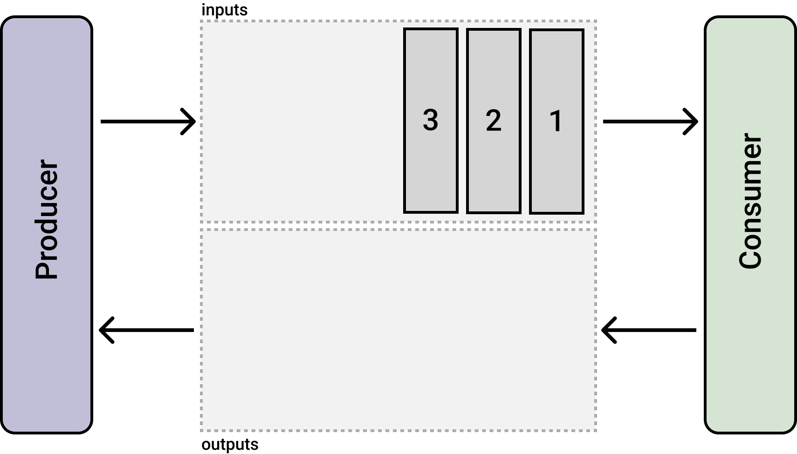
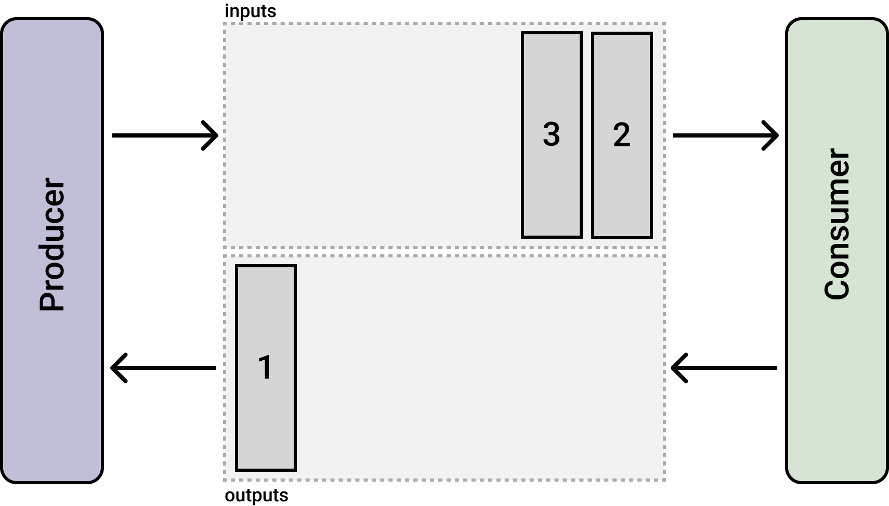
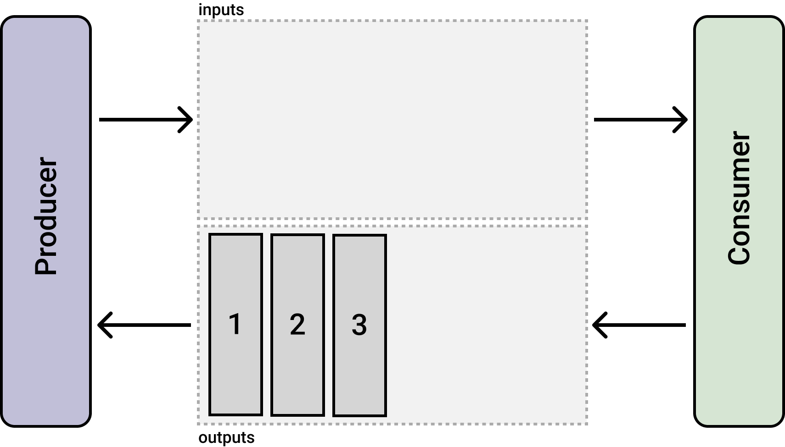

## Any Inference 🚀

🚧 This project is in WIP

`any-inference` is a python package that uses a message broker, [`rabbitmq`](https://www.rabbitmq.com/), to send, consume and receive replies. 

It's aim to **ease machine learning model inference** since we can take advantage of the message queues to process and batch multiple messages. Moreover, when used with an HTTP server (e.g. [flask](https://flask.palletsprojects.com/en/2.1.x/)) we can use as many process as we want to handle the incoming requests.

## How it works

The main idea is to use two queues, `inputs` and `outputs`. The `Producer` will place messages into a `inputs` queue (here shown with `ids=1,2,3`) and the `Consumer` will consume them. 

**Assume the `Consumer` will use this messages as input to a machine learning model**, e.g. the messages contains images and we want to predict classes.

Once the `Consumer` is done, it will place it's reply `messages` back to the `outputs` queue from which the `Producer` can read.

### Batch Inference

We can also go one step further, once the `Consumer` receive a message, it will wait a little bit and consume all the messages in the queue in one go. This will allow us to batch message together and send them for inference.

## Getting Started

Head over the [getting started](getting_started) section.

## Examples

Head over the [examples](examples) section.
